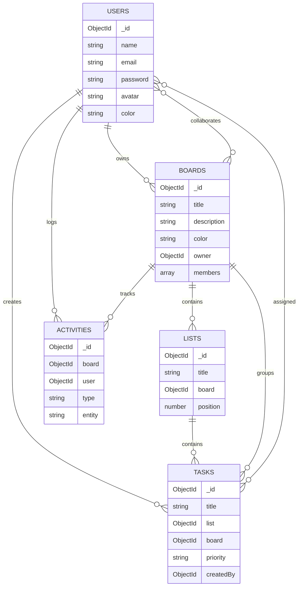

# TaskFlow — Real-Time Task Collaboration Platform

TaskFlow is a Trello/Notion-inspired task collaboration platform that supports real-time updates, drag-and-drop Kanban boards, multi-user collaboration, and activity tracking.

Repository: https://github.com/navyasree981/taskflow
Deployed website link - https://taskflow-frontend-b3yj.onrender.com

## Demo Credentials

**Owner**

- Email: coder1@gmail.com
- Password: coder1

**Collaborator**

- Email: coder2@gmail.com
- Password: coder2

---

## Tech Stack

### Frontend

- React (Vite)
- Zustand (state management)
- TailwindCSS
- dnd-kit (drag and drop)
- Socket.IO Client
- Axios

### Backend

- Node.js
- Express.js
- MongoDB
- Mongoose
- Socket.IO
- JWT Authentication
- bcrypt

---

## Quick Start Guide (Local Setup)

### Prerequisites

- Node.js ≥ 18
- MongoDB (local) or MongoDB Atlas

### 1. Clone Repository

```bash
git clone https://github.com/navyasree981/taskflow.git
cd taskflow
```

### 2. Backend Setup

```bash
cd backend
npm install
cp .env.example .env
npm run dev
```

**backend/.env**

```env
PORT=5000
NODE_ENV=development
MONGO_URI=mongodb://localhost:27017/taskflow
JWT_SECRET=your_secret
JWT_EXPIRES_IN=7d
CLIENT_URL=http://localhost:5173
```

Backend runs at: [http://localhost:5000]

### 3. Frontend Setup (New Terminal)

```bash
cd frontend
npm install
cp .env.example .env
npm run dev
```

**frontend/.env**

```env
VITE_API_URL=http://localhost:5000/api
VITE_SOCKET_URL=http://localhost:5000
```

Frontend runs at: [http://localhost:5173]

---

## Frontend Architecture

- **Pages:** Login, Register, Dashboard, Board
- **State Management:** Zustand stores for auth, boards, lists, and tasks
- **API Layer:** Axios client with JWT interceptor
- **Real-Time Layer:** Socket.IO client joins board-specific rooms
- **Drag & Drop:** dnd-kit for task and list reordering

**Flow:**
UI → Zustand Store → API / Socket → Store Update → UI Re-render

---

## Backend Architecture

- **Layered Structure:** Routes → Middleware → Controllers → Models
- **Authentication:** JWT-based route protection
- **Database Layer:** Mongoose schemas and validation
- **Real-Time Engine:** Socket.IO broadcasting board-level events

**Flow:**
Request → Auth Middleware → Controller → MongoDB → Socket Event → Clients

---

## Database Schema

### Collections and Fields (Names Only)

### users

- \_id
- name
- email
- password
- avatar
- color
- createdAt
- updatedAt
- \_\_v

### boards

- \_id
- title
- description
- color
- background
- owner
- members
- isArchived
- listOrder
- createdAt
- updatedAt
- \_\_v

### lists

- \_id
- title
- board
- position
- color
- taskOrder
- isArchived
- createdAt
- updatedAt
- \_\_v

### tasks

- \_id
- title
- description
- list
- board
- position
- assignees
- priority
- dueDate
- cover
- isArchived
- createdBy
- labels
- checklist
- attachments
- createdAt
- updatedAt
- \_\_v

### activities

- \_id
- board
- user
- type
- entity
- entityId
- entityTitle
- description
- createdAt
- updatedAt
- \_\_v

---

## Database Schema Diagram



---

## API Contract Design

Base URL: `http://localhost:5000/api`

### Auth

- POST `/auth/register`
- POST `/auth/login`
- GET `/auth/me`

### Boards

- GET `/boards`
- POST `/boards`
- GET `/boards/:id`
- PUT `/boards/:id`
- DELETE `/boards/:id`
- POST `/boards/:id/members`

### Lists

- POST `/lists`
- PUT `/lists/:id`
- DELETE `/lists/:id`
- PUT `/lists/reorder`

### Tasks

- POST `/tasks`
- GET `/tasks/:id`
- PUT `/tasks/:id`
- DELETE `/tasks/:id`
- PUT `/tasks/:id/move`
- POST `/tasks/:id/assign`
- GET `/tasks/search`

### Activity

- GET `/activity/board/:boardId`

**Authorization Header**

```
Authorization: Bearer <token>
```

---

## Real-Time Sync Strategy

- Clients join board-specific rooms: `board:{boardId}`
- Server broadcasts updates using Socket.IO

**Events**

- task:created
- task:updated
- task:moved
- list:created
- board:updated

**Strategy**

- Optimistic UI updates on client
- Server emits final state to all collaborators
- Clients reconcile local state with server events

---

## Scalability Considerations

- Horizontal scaling with multiple Node instances
- Redis adapter for Socket.IO event synchronization
- MongoDB indexes for faster board/list/task queries
- Optional caching layer (Redis) for frequently accessed boards

---

## Assumptions & Trade-offs

### Assumptions

- Boards have limited concurrent editors
- Tasks per board remain within UI performance limits

### Trade-offs

- JWT stored client-side for simplicity
- Optimistic updates improve UX but require rollback logic
- No offline support in current version

---

## License

MIT
